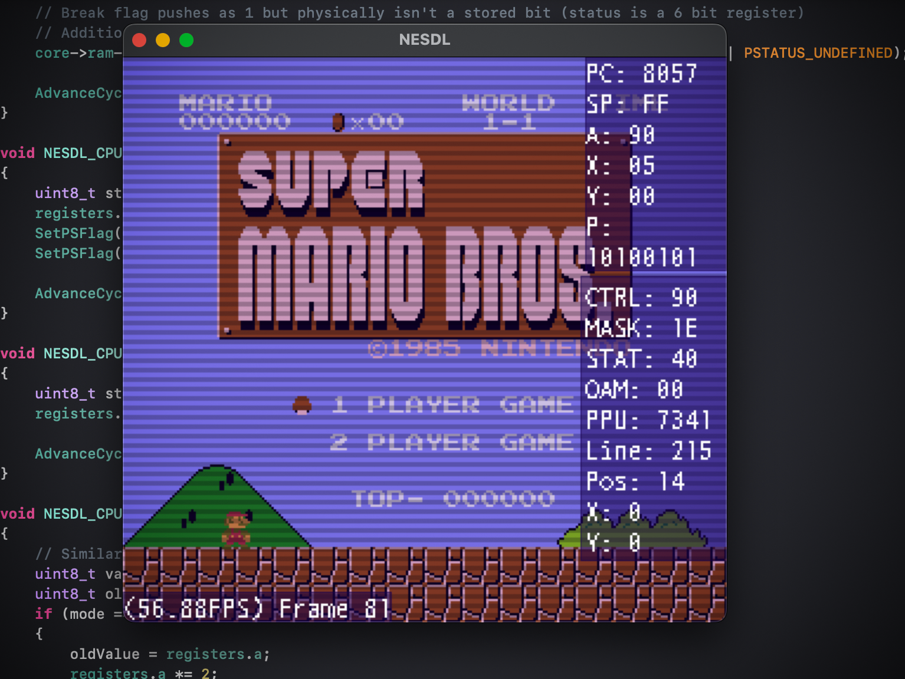

# NESDL

[![windows](https://img.shields.io/badge/Build-Windows-green?style=flat&logo=data%3Aimage%2Fpng%3Bbase64%2CiVBORw0KGgoAAAANSUhEUgAAAgAAAAIACAQAAABecRxxAAAABGdBTUEAALGPC%2FxhBQAAACBjSFJNAAB6JgAAgIQAAPoAAACA6AAAdTAAAOpgAAA6mAAAF3CculE8AAAAAmJLR0QA%2F4ePzL8AAAAHdElNRQfoBwENJANcZqt1AAAEt0lEQVR42u3dsQ2DMBCG0TNiJXaApSiyR%2BYwO6TMDJnjWIAC0lg6vddf88v6WrfMoLqjbc%2BPssdquuomE4AAAAIACAAgAIAAAAIACAAgAIAAAAIACAAgAIAAAAIACAAgAIAAAAIACAAgAIAAAAIACAAgAIAAAAIACAAgAIAAAAIACAAgAIAAAAIACAAgACAAgAAAAgAIACAAgAAAAgAIACAAgAAAAgAIACAAgAAAAgAIACAAgAAAAgAIACAAgAAAAgAIACAAgAAAAgAIACAAgAAAAgAIACAAgAAAAgAIACAAIACAAAACAAgAIACAAAACAAgAIACAAAACAAgAIACAAAACAAgAIACAAAACAAgAIACAAAACAAgAIACAAAACAAgAIACAAAACAAgAIACAAAACAAgAIAAgAIAAAAIACAAgAIAAAAIACAAgAIAAAAIACAAgAIAAAAIACAAgAIAAAAIACAAgAIAAAAIACAAgAIAAAAIACAAgAIAAAAIACAAgAIAAAAIACAAgACAAgAAAAgAIACAAgAAAAgAIACAAgAAAAgAIACAAgAAAAgAIACAAgAAAAgAIACAAgAAAAgAIACAAgAAAAgAIACAAgAAAAgAIACAAgAAAAgAIACAAIACAAAACAAgAIACAAAACAAgAIACAAAACAAgAIACAAAACAAgAIACAAAACAAgAIACAAAACAAgAIACAAAACAAgAIACAAAACAAgAIACAAAACAAgAIAAgAIAAAAIACAAgAIAAAAIACAAgAIAAAAIACAAgAIAAAAIACAAgAIAAAAIAjDHH2wjlff%2B6OuJnOgAAAAAAAAAAAAAAAAAAAAAAAAAAAAAAAACA%2B1p2I5T3afvzo3zFYrrq5liNwKXF26jP78AgAIAAAAIACAAgAIAAAAIACAAgAIAAAAIACAAgAIAAAAIACAAgAIAAAAIACAAgAIAAAAIACAAgAIAAAAIACAAgAIAAAAIACAAgAIAAAAIACAAIgAlAAAABAAQAEABAAAABAAQAEABAAAABAAQAEABAAAABAAQAEABAAAABAAQAEABAAAABAAQAEABAAAABAAQAEABAAAABAAQAEABAAAABAAQAEAAQAEAAAAEABAAQAEAAAAEABAAQAEAAAAEABAAQAEAAAAEABAAQAEAAAAEABAAQAEAAAAEABAAQAEAAAAEABAAQAEAAAAEABAAQAEAAAAEABAAQABAAQAAAAQAEABAAQAAAAQAEABAAQAAAAQAEABAAQAAAAQAEABAAQAAAAQAEABAAQAAAAQAEABAAQAAAAQAEABAAQAAAAQAEABAAQAAAAQAEABAAEABAAAABAAQAEABAAAABAAQAEABAAAABAAQAEABAAAABAAQAEABAAAABAAQAEABAAAABAAQAEABAAAABAAQAEABAAAABAAQAEABAAAABAAQAEAAQAEAAAAEABAAQAEAAAAEABAAQAEAAAAEABAAQAEAAAAEABAAQAEAAAAEABAAQAEAAAAEABAAQAEAAAAEABAAQAEAAAAEABAAQAEAAAAEABAAQABAAQAAAAQAEABAAQAAAAQAEABAAQAAAAQAEABAAQAAAAQAEABAAQAAAAQAGOQHLshFV6K14LgAAACV0RVh0ZGF0ZTpjcmVhdGUAMjAyNC0wNy0wMVQxMzozNjowMiswMDowMJfNZf8AAAAldEVYdGRhdGU6bW9kaWZ5ADIwMjQtMDctMDFUMTM6MzY6MDIrMDA6MDDmkN1DAAAAAElFTkSuQmCC)](https://github.com/GDFauxtrot/NESDL/releases)

An NES emulator written in C++ and SDL2. Just a fun project to see if I could make one, nothing more! Made for Windows and Mac, but a Linux build should be possible as well.

**Note:** this is *EARLY* in development! It is missing several features, such as:

  * Some popular ROM mappers (see below for list)
  * Player 2 (the logic is in place, but no keybinds yet)
  * Non-standard controller support (eg. Zapper, Power Pad, and so on)
  * Rebindable controls
  * Save/load states
  * Cartridge save data (eg. Excitebike stages, Kirby's Adventure progress, etc.)
  * PAL & Famicom support
  * NES 2.0 header ROMs
  * Palette configuration
  * Audio/volume configuration

## Controls

Currently, controls are hard-bound to the keyboard (mainly for me to use while development is under-way):

  * **D-Pad** - WASD
  * **A** - N
  * **B** - M
  * **SELECT** - Comma (,)
  * **START** - Period (.)

## To-Do

***Each action item is checkmarked to show progress*** (Updated 4/25/2025)

### General/Misc

- MMC3 mapper support (iNES mapper 4)
  - [x] IRQ/A12 clocking basics
  - [ ] IRQ "details"
  - [ ] IRQ scanline timing
  - [ ] MMC3A accuracy
  - [ ] MMC3B accuracy
- Configuration file
  - [x] Config reading/writing basics
  - [ ] Config categories
  - [ ] Store player controls (and read on NESDL startup)
  - [ ] Store audio levels (and rest on NESDL startup)
- Basic APU support (audio)
  - [x] 4 basic audio channels
  - [ ] PCM audio channel
  - [ ] PCM IRQ
- NES 2.0 header support
  - [ ] Implement NES 2.0 parity with iNES support in NESDL
- Options/Settings menu
  - [ ] Decide on approach/build a basic window
  - [ ] Add controls customization
  - [ ] Add per-channel audio customization
- [ ] Save/load state support
  * Could it be cross-emulator supported - FCEUX/Nintendulator/NESTopia loads our save state? Is there an agreed-upon standard here?
- [ ] Famicom emulation (& PAL support)
- [ ] Ubuntu & Arch package builds?

### Mappers

According to [this list](https://github.com/rynorris/nes/issues/31) (source info is currently down), the following mappers make up nearly 90% of the entire NES library, in order of popularity:

- [X] Mapper 1 (MMC1)
- [ ] Mapper 4 (MMC3)
- [ ] Mapper 2 (UxROM)
- [x] Mapper 0 (NROM)
- [ ] Mapper 3 (CNROM)
- [ ] Mapper 7 (AxROM)

Low priority:

- [ ] Mapper 206 (DxROM/earlier MMC3)
- [ ] Mapper 11 (Color Dreams)
- [ ] Mapper 5 (MMC5) (notably Castlevania III)
- [ ] Mapper 19 (Namco 129/163)

Some notable mappers I want implemented as well:

- [x] Mapper 9 (just (Mike Tyson's) Punch-Out!!)

## Building

Development instructions are heavy work-in-progress, due to lack of time and personal inexperience making open source software that's easy to download and compile.

### Dependencies

This project is built using **[SDL2](https://github.com/libsdl-org/SDL/releases)** (2.30.6) and **[SDL2_ttf](https://github.com/libsdl-org/SDL_ttf/releases)** (2.22.0), you will want to download the development (or "devel") versions of each on their official GitHub pages.

### Windows

This project was heavily developed on Mac, but started and is fully capable on Windows as well (thanks SDL!)

NESDL has been tested on Visual Studio 2017+ and Windows 10+, though I see no issues with running NESDL on a Windows OS as old as SDL2 will allow (it may be fun to test this).

Make sure your dev environment has SDL2 properly configured! I need to make this process easier but what you'll need to do is [outlined in this guide by Lazy Foo'](https://lazyfoo.net/tutorials/SDL/01_hello_SDL/windows/msvc2019/index.php). (Or, just unzip the SDL devel libraries in the same folder as mine, "C:\\vclibs\\...", and then either make sure SDL2 and SDL2_ttf is in your system PATH or DLL's included in your build directory.)

A final step to ensure fonts are working in your dev builds - include the "font" folder where your NESDL build executables are.

### Mac

As of writing this (4/14/2025), it has been some time since I have opened the project on a Mac device. The same dependencies are in place for Mac as they are for Windows (a development copy of SDL2 and SDL2_ttf configured for your local Xcode development environment, ideally matching versions). At some point I will ensure the project can be easily cloned and ran with proper instructions!

## License

This software is licensed under [GNU GPLv3](https://choosealicense.com/licenses/gpl-3.0/), and has been included in this repository (see LICENSE for a copy)

This software uses the library [nativefiledialog](https://github.com/mlabbe/nativefiledialog). Its license [can be found here](https://github.com/mlabbe/nativefiledialog/blob/master/LICENSE). Some modification of the source code has been performed, including removing the removal of platform-specific files; any further modifications have been denoted in the source code itself.

This software uses the library [Simple Config Library](https://github.com/WizardCarter/simple-config-library). Its license [can be found here](https://github.com/WizardCarter/simple-config-library/blob/master/LICENSE). Some modification of the source code has been performed; these modifications have been denoted in the source code itself.